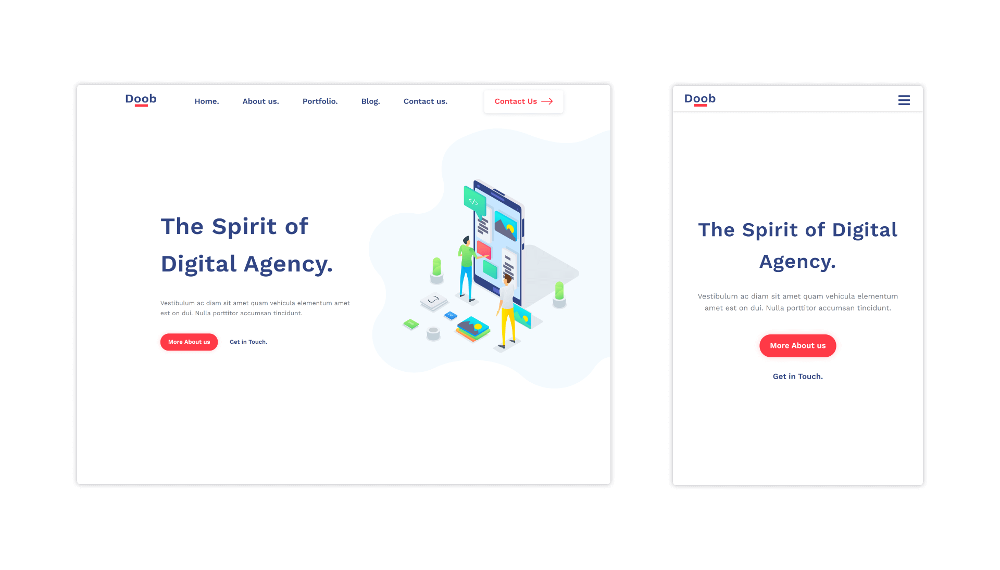

<h1 align='center'>Doob Agency Website</h1>

A website for Doob agency created with HTML and CSS!

**Note:** This website is created for practicing on the front-end.

## Design View

## Live Demo
👁 [Click here](https://mohammadjarabah.github.io/doob-agency-website) to check out the live demo!

## Technologies Used
* 
* 

## Features
* ⭐ Single page design
* 🤖 Responsive design on all devices
* ⚡ Fast and lightweight design
* 🍫 Responsive navigation bar with custom designs for desktops & mobiles
* 🌱 Smooth scroll for navigation bar links
* 🌐 7 Sections including: Header, Services, About us, Portfolio, Blogs, Contact us, and Footer
* 👓 Cool animations at the Portfolio and Blogs sections
* 🌍 Footer section with 4 sub-sections for: Name, Links, Copyright, and Social Links
* 🌌 The design contains all images as an SVG except portfolio images
* 🌚 Elegant contact section
* 🎨 SVG logo & icons
* ✨ And more!

## Credits
* PSD Template is from [Graphberry](https://www.graphberry.com)
* Fonts are from [Google Fonts](https://fonts.google.com)
* SVG Icons are from [Font Awesome](https://fontawesome.com)
* Images are from [Behance](https://www.behance.net)
